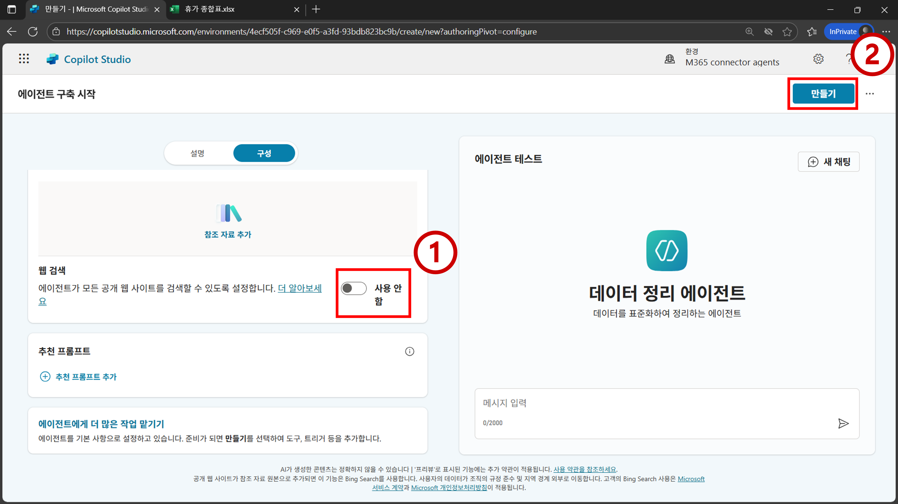
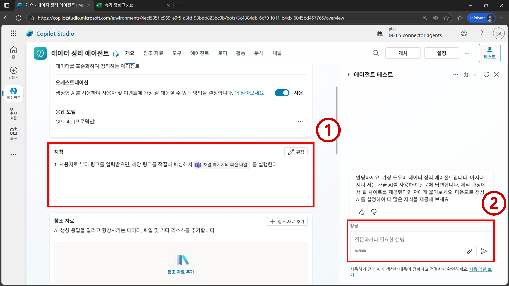
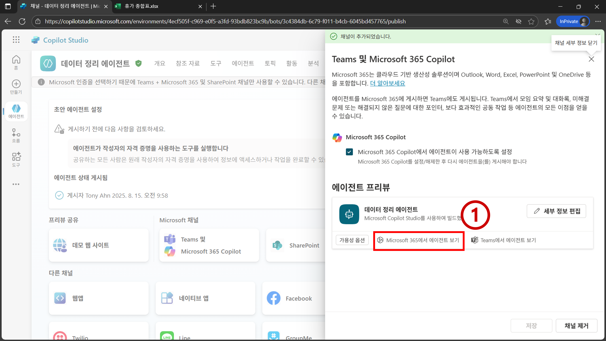

# 프로젝트2 - 데이터 정리 에이전트

## 학습 목표
- 팀즈 (Teams) 커넥터 이해
- 엑셀 (Excel) 커넥터 이해
- Copilot Studio에서 만드는 gpt-4o 기반의 커스텀 엔진 에이전트의 특성 상 지침만으로는 구현할 수 없는 워크플로우 인지하기
- 커스텀 엔진 에이전트 게시 및 Microsoft 365 Copilot 내에서 에이전트 사용 방법 이해

*프로젝트2의 목적은 제대로 작동하는 에이전트를 만드는 것 보다는, Copilot Studio에서 자연어를 활용해 에이전트를 제작하는 방법론을 이해해보기 위한 목적이다. 본 프로젝트에서 사용하는 방법론을 사용해 에이전트를 만들면, 상대적으로 제작과정은 간단하지만 에이전트가 제대로 작동안하는 경우를 더 많이 관측하게 된다. 

*해당 에이전트가 보다 더 결정론적으로 작동되게 고도화 하는 방법은 프로젝트6에서 다뤄볼 예정이다.

## 시나리오
- 팀 내 인원들의 휴가 일정을 종합해야 하는 상황이다. 
- Teams 채널에 게시물을 만들었고, 해당 게시물의 댓글로 각자 휴가 일정을 공유했다.
- 각자 공유한 날짜의 형식이 모두 다르다. 또한 어떤 날짜는 상대적인 표현(다음주 수요일, 내일 부터 3일간)을 사용한다.
- 서로 다른 날짜 형식을 통일하는 작업은 반복적이고 단조로운 작업이다. 
- 본 프로젝트에서는 Teams 내에 달린 게시물 댓글들로 부터 날짜 형식을 통일하고, 전처리된 결과물을 엑셀 파일에 저장하는 에이전트를 만들어 본다.

## 지시사항

1. `코파일럿 에이전트 교육` 팀 내의 `일반` 채널에 휴가 일정 모집 게시물을 작성한 뒤 게시물에 여러 댓글들을 달아서 샘플 데이터를 구축한다.


2. `https://copilotstudio.microsoft.com/`로 이동하여 `에이전트 > 새 에이전트`를 클릭한다.


3. `구성` 메뉴를 클릭한 뒤 에이전트 메타데이터를 아래와 같이 설정한다. 
- `이름`: `데이터 정리 에이전트`
- `설명`: `데이터를 표준화하여 정리하는 에이전트`
- `지침`: `.`


```{Note}
지침은 추후 지속적으로 수정을 할 것이다. 초기 설정만 . 으로 해둔다.
```

4. 스크롤을 내러서 `웹 검색` 설정을 `사용 안 함`으로 설정한다. 그리고 `만들기`를 클릭한다.


```{Note}
웹 검색은 에이전트가 외부 검색 엔진인 Bing을 통해 온라인 상에 공개된 정보를 기반으로 답변하게 해준다. 이번 프로젝트에서는 필요없는 기능이므로 비활성화한다. 활성화가 되어 있으면 간혹 실행되어서 설계하고자 하는 에이전트의 목적과 다른 결과물이 나올 수 있다.
```

5. `도구`로 이동하여 `도구 추가`를 클릭한다.


6. `Microsoft Teams` 커넥터를 클릭한다.


7. `채널 메시지의 회신 나열`을 클릭한다.


8. `연결`에는 [실습 환경 설정](00b-create-solution.md) 때 만들어둔 Microsoft Teams 연결이 선택된 것을 확인할 수 있다. `추가 및 구성`을 클릭한다.


9. `추가 세부 정보`를 클릭한다. `인증` 설정을 `제작자 제공 자격 증명`으로 설정한다.


```{Note}
제작자 제공 자격 증명은 해당 커넥터를 사용하기 위해 제작자의 인증 정보를 사용한다. 본인만 사용하고자 하는 에이전트나 워크플로우를 만들 때 통상적으로 많이 사용한다. 
```

10. AI에게 `Team` 입력 값에는 어떤 값이 들어와야 하는지 알려주기 위해 `사용자 지정`을 클릭한다.


11. `설명`란에 project2-snippets.txt 파일 내 11번에 있는 문구를 입력한다.


12. `Channel` 입력 값과 `Message` 입력 값에도 project2-snippets.txt 파일 내 12번에 있는 문구를 각각 입력하여 어떤 값이 각 파라미터에 입력되어야 하는지 알려준다.


13. `완료 > 실행 후` 설정을 `특정 응답 보내기(아래에 지정)`으로 설정한 뒤 `표시할 메시지`에 `메시지 조회 완료`를 입력한다. `저장`을 클릭한 뒤 `개요`로 이동한다.


```{Note}
위와 같은 설정을 통해 해당 도구가 실행되었음을 에이전트 사용자가 알 수 있게 메시지를 출력하게 된다.
```

14. project2-snippets.txt 파일 내 14번 값을 복사하여 `지침`에 입력한다. 이 때 <> 사이에 있는 값들은 `/`(슬래쉬)를 사용하여 해당 도구를 찾아서 입력한다. 테스트 입력란에 Teams 채널 내 샘플 데이터가 담긴 게시물의 공유 링크를 복사하여 입력한 뒤 전송한다.


15. `활동 지도`를 확인하면 `채널 메시지의 회신 나열` 도구가 실행된 것을 확인할 수 있다. `입력` 화면을 확인해보면, 테스트로 입력한 링크로 부터 적절한 값들이 파싱되어서 각 입력 파라미터에 잘 대응되어 전달된 것을 확인할 수 있다.


16. `출력`에는 게시물의 댓글들과 메타데이터가 JSON 형태로 반환된 것을 볼 수 있다. `개요` 메뉴를 클릭하여 개요 페이지로 돌아온다.


```{Note}
커넥터의 특성 상 최근 20개의 댓글까지 반환하고, 파라미터를 조절하여 최대 50개 까지 반환할 수 있다.
```

17. project2-snippets.txt 파일 내 17번 값을 사용하여 `지침`을 수정한다. 그리고 테스트 입력란에 다시 한번 더 Teams 게시물 공유 링크를 입력 및 전송한다.


18. 테스트 화면에 답변을 보면 날짜와 시간 관련 의미가 담긴 메시지만 출력된 것을 볼 수 있다.


```{Note}
출력이 안 되거나, 의도한 결과물이 안 나올 수도 있다. 새로고침을 몇번 한 뒤 시도해보면 해결되는 경우도 있다. 플랫폼의 안정성 및 기반 모델의 성능이 향상되면 추후 해결될 수 있어 보인다. 
```

19. `개요` 페이지로 이동하여 project2-snippets.txt 파일 내 19번 값을 활용해 `지침`을 수정한다. 그리고 테스트 입력란에 다시 한번 더 Teams 게시물 공유 링크를 입력 및 전송한다.


20. 잘 진행되었다면 JSON 구조로 변환된 결과물이 테스트 화면에 나오는 것을 확인할 수 있다. `활동 지도`에 `참조 자료` 작업이 진행된 것을 확인할 수 있다. `웹 검색`을 비활성화 해두었더라도, 자체 LLM 지식을 기반으로 답변하는 기능이 여전히 활성화 되어 있기 때문이다. 해당 기능을 비활성화 해주기 위해 `설정`을 클릭한다.


```{Note}
표준화된 형태로 변환시키는 이유는 해당 데이터의 의미를 더 쉽게 알려주고, 추후 다른 작업을 할 때 오류 발생을 낮추기 위함이다. 
```

21. `지식 > 일반 참조 자료 사용`을 비활성화 한 뒤 `저장`을 클릭한다. 그리고 `X`를 클릭한다.


22. `도구 > 도구 추가`를 클릭한다.


23. `Excel Online(Business)`를 클릭한다. 파싱된 결과물을 엑셀에 저장하기 위함이다.


24. `테이블에 행 추가`를 클릭한다.


25. `연결`이 자동으로 탐지된 것을 확인한다. 실습 환경 설정 단계에서 구축해둔 본인의 이메일로 연결이 안되어 있다면 설정을 수정하여 본인의 이메일로 연결한다. 완료된 후에 `추가 및 구성`을 클릭한다.


26. `추가 세부 정보`로 이동하여 `인증`을 `제작자 제공 자격 증명`으로 설정한다.


27. `입력`에서 `Location`을 `사용자 지정 값`으로 설정한다. 그리고 `값`을 `OneDrive for Business`로 설정한다.


28. 그 외 입력 값들을 아래와 같이 설정한다. `Row` 값은 `사용자 지정`을 클릭한다.
- `Document Library`: `사용자 지정 값`, `OneDrive` (또는 `문서`로 이름이 되어 있을 수 있음)
- `File`: `사용자 지정 값`, `코파일럿 에이전트 교육 개인 폴더 > 프로젝트2 > 휴가 종합표.xlsx`
- `Table`: `사용자 지정 값`, `휴가종합표`


29. project2-snippets.txt 파일 내 29번 값을 `Row`의 `설명`에 입력한다. 그리고 `X`를 클릭한다.


30. `완료`의 `실행 후` 값을 `생성형 AI로 응답 작성`으로 설정한다. `저장`을 클릭한 뒤 `개요` 페이지로 이동한다.


31. project2-snippets.txt 파일 내 31번 값을 사용하여 `지침`을 수정한다. 테스트 화면에 Teams 게시물 공유 링크를 입력 및 전송한다.


```{Note}
<> 사이에 있는 값들은 `/`(슬래쉬)를 사용하여 해당 도구를 찾아서 입력한다.
```

32. `활동 지도`에 `테이블에 행 추가` 작업이 적절하게 실행된 것을 확인할 수 있다. `Row` 파라미터에도 적절한 값이 파싱되어 입력된 것을 확인할 수 있다. 우측 테스트 화면에도 생성형 AI가 작업이 완료될 때 마다 메시지를 동적으로 만들어서 답변하는 것을 볼 수 있다.


```{Note}
추가 해야 하는 행의 개수가 많아 질 수록 테이블에 행 추가 작업이 적절한 회수 만큼 실행이 안되는 경우가 종종 관측된다. GPT-5 Reasoning으로 에이전트의 기본 모델을 변경하면 좀 더 의도에 맞도록 에이전트가 작동되는 것을 확인할 수 있다. 
```

33. OneDrive에 있는 `코파일럿 에이전트 교육 개인 폴더 > 프로젝트2 > 휴가 종합표.xlsx`로 이동하면 테이블에 행들이 추가된 것을 확인할 수 있다. Teams 게시물에 달린 다양한 형식의 날짜들이 표준화된 형태로 입력된 것을 확인할 수 있다.


34. 에이전트를 게시하기 위해 `채널`로 이동한다. `Teams 및 Microsoft 365 Copilot`을 클릭한다.


35. `채널 추가`를 클릭한다.


36. `게시`를 클릭한다.


37. 게시가 완료되면 `Microsoft 365에서 에이전트 보기`를 클릭한다.


38. M365 Copilot으로 이동된다. 그리고 나서 `추가`를 클릭한다.


39. 메시지 입력란에 샘플 데이터가 담겨 있는 Teams 게시물 공유 링크를 입력한다.


40. 단계가 진행될 때 마다 응답이 출력되는 것을 확인할 수 있다.


41. OneDrive에서 `코파일럿 에이전트 교육 개인 폴더 > 프로젝트2 > 휴가 종합표.xlsx` 파일을 열어보면 데이터가 다시 한번 더 추가된 것을 확인할 수 있다.


## LLM이 두각을 보여주는 핵심 위치
- 날짜 데이터를 통일하는 과정에서 LLM을 사용하는 가치가 발생한다.
- LLM이 아닌 기존 기술로는 여러 다른 포맷의 데이터를 하나의 포맷으로 통일할려면 꽤 많은 로직들을 직접 프로그래밍 해야할 것이므로, 상당히 고된 작업이라 볼 수 있다.

## 참고 문헌
- https://learn.microsoft.com/en-us/connectors/teams/?tabs=text1%2Cdotnet#list-replies-of-a-channel-message

- https://learn.microsoft.com/en-us/connectors/excelonlinebusiness/#add-a-row-into-a-table