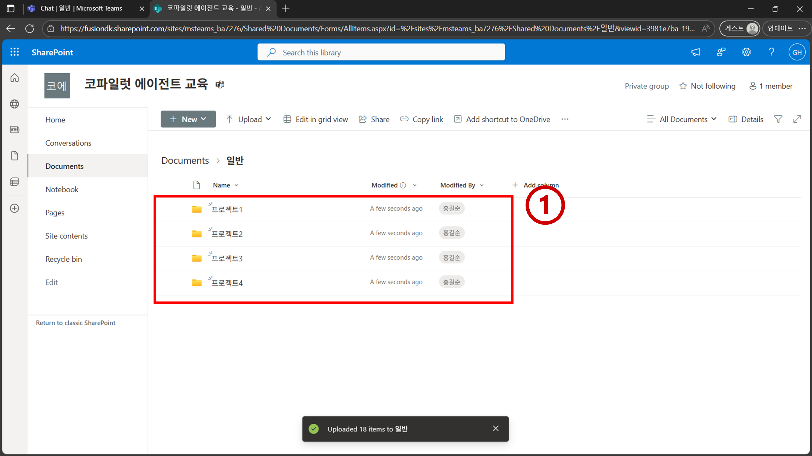

# 실습 데이터 업로드

## 학습 목표
- 쉐어포인트에 실습에 필요한 데이터 업로드

## 시나리오
- 쉐어포인트 사이트를 만든 뒤 실습에서 사용할 각종 데이터들을 업로드 한다.

## 지시사항

1. `http://teams.microsoft.com/`로 이동하여 `새 팀`을 클릭한다.

2. `팀 이름`을 `코파일럿 에이전트 교육`으로 설정한다. `팀 유형`은 `비공개`로 설정한다. `첫번째 채널 이름`을 `일반`으로 설정한 뒤 `만들기`를 클릭한다.

3. `파일` 메뉴로 이동하여 `... > SharePoint에서 열기`를 클릭한다.

4. `일반`폴더를 클릭한다.

5. 비어있는 공간에 [제공되는 실습 데이터](../../data/)를 업로드 한다.

6. 아래와 같이 데이터를 업로드한다.

7. 새롭게 만든 SharePoint 사이트의 주소를 잘 기억한다. 추후 프로젝트에서 필요한 값이다. `https://<테넌트명>.sharepoint.com/sites/<SharePoint 사이트 고유 id>`

