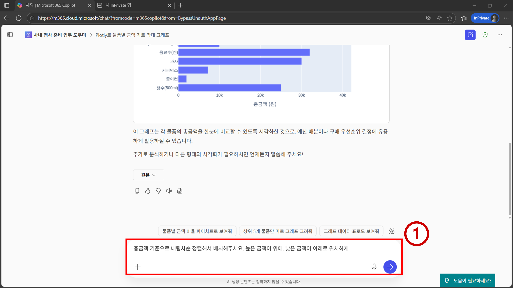
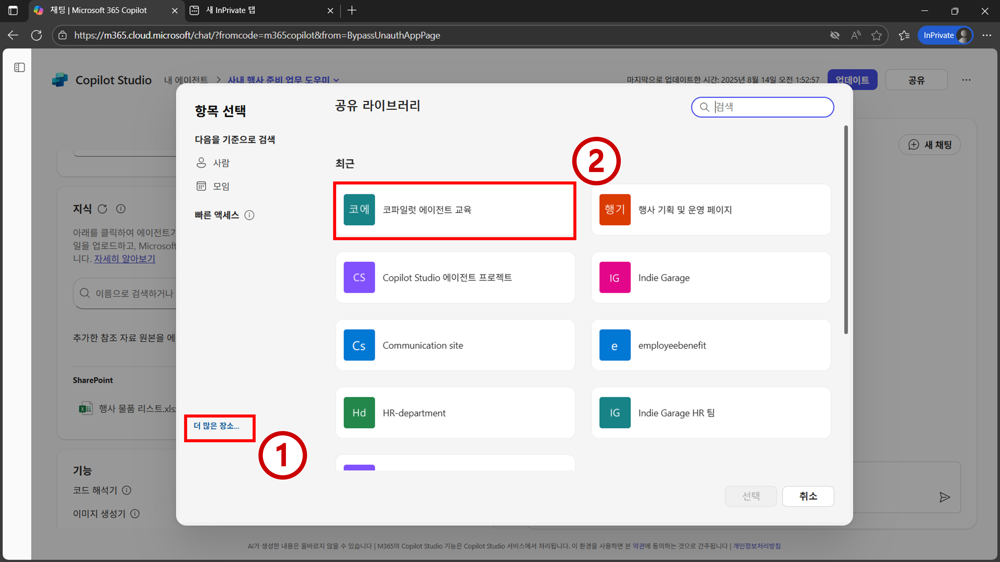

# 프로젝트1 - 사내 행사 준비 업무 도우미 에이전트

<iframe width="560" height="315" src="https://www.youtube.com/embed/C-UtF2UK1uY" title="프로젝트1 사내 행사 준비 업무 도우미 에이전트" frameborder="0" allow="accelerometer; autoplay; clipboard-write; encrypted-media; gyroscope; picture-in-picture; web-share" referrerpolicy="strict-origin-when-cross-origin" allowfullscreen></iframe>

## 학습 목표
- M365 Copilot에 내장된 [Copilot Studio Lite](https://learn.microsoft.com/en-us/microsoft-365-copilot/extensibility/copilot-studio-experience) 활용
- 지침(Instructions) 이해
- 지식(Knowledge) 이해
- 기능(Capabilities) 이해

## 시나리오
- 사내 행사 준비를 위해 필요한 물품들을 정리해둔 상황이다. 
- 해당 물품 중 어떤 물품들이 구매 전 부서장 승인이 필요한지 확인해야 한다. 
- 해당 작업을 위해 각 실무자들이 사내 규정 파일이 있는 쉐어포인트 사이트 까지 매번 접근해서 규정 파일을 열어보는 상황이며, 부서장 승인 기준 금액을 확인 후 다시 물품 구매 리스트 파일을 열어서 어떤 물품이 금액이 기준에 부합하여 부서장 승인이 필요한지 확인하는 작업을 매번 진행하고 있다. 
- 또한 행사 운영진 회의 때 발표용으로 간단한 물품별 금액 시각화 차트도 필요한 상황이다.
- 본 프로젝트에서는 이러한 작업들을 간소화해주는 에이전트를 만들어 본다.

## 지시사항

1. `https://m365copilot.com/`로 이동하여 `에이전트 > 에이전트 만들기`로 이동한다.


2. 좌측 상단에 메뉴 접기 아이콘을 눌러 작업하기 편하게 화면을 설정한다. `구성`을 클릭한 뒤 에이전트의 `이름`, `설명`, `지침` 메타데이터를 아래와 같이 설정한다. 그리고 우측 메시지 입력란에 `행사 시 준비해야 하는 물품들 어떤게 있었나요?`를 입력 및 전송한다. 에이전트가 일반적인 답변을 하는 것을 확인할 수 있다.
- `이름`: `사내 행사 준비 업무 도우미`
- `설명`: `사내 행사 기획 시 관련 업무를 도와주는 에이전트`
- `지침`: `사용자의 질문에 친절하게 답변하주세요.`


```{Note}
설명 기능을 사용해서 에이전트의 메타데이터 초안을 입력할 수도 있다. 다만 교육 진행 시에는 일관적인 경험을 제공하는 구성 기능을 사용한다.

설명에는 해당 에이전트가 어떤 에이전트인지 입력한다. 거버넌스 차원에서 해당 에이전트가 어떤 용도의 에이전트인지 파악할 수 있고, 추후 멀티 에이전트 아키텍쳐 구축 시 특정 에이전트가 어떤 상황에서 사용되어야 하는지 영향을 미치는 것이 이름 및 설명 값이다.

지침에는 해당 에이전트가 어떻게 작동했으면 하는지, 어조, 등을 입력하여 에이전트의 이상적인 작동 방식에 영향을 미칠 수 있다. LLM API를 가지고 소프트웨어 개발할 때 흔히 사용하는 파라미터인 system_message와 유사하다.
```

3. 현재 까지의 행사 준비 현황 컨텍스트를 기반으로 답변하게 하기 위해 `지식`에서 `클라우드 파일 첨부` 아이콘을 클릭한다.


4. `더 많은 장소`를 클릭한 뒤 `코파일럿 에이전트 교육` 쉐어포인트 사이트를 클릭한다.


5. `일반 > 프로젝트1` 경로로 이동하여 `행사 물품 리스트.xlsx` 파일을 선택한다. 그리고 `선택` 버튼을 클릭한다.


6. `새 채팅`을 클릭하고 메시지 입력란에 `행사 시 준비해야 하는 물품들 어떤게 있었나요?`를 입력 및 전송한다. 결과물을 확인하면 `행사 물품 리스트.xlsx` 파일 내 데이터를 기반으로 답변하는 것을 볼 수 있다. 현재까지의 물품 리스트 맥락을 알고 있는 에이전트가 되었다.


7. 스크롤을 내려 보면 `참조`란에 `행사 물품 리스트.xlsx` 파일이 참조된 것을 확인할 수 있다.


8. 데이터 시각화를 하기 위해 `물품을 Y축, 물품별 금액을 X축으로 하는 가로 막대 그래프 그려주세요`를 메시지 입력란에 입력 및 전송한다.


9. 결과물을 보면 데이터 시각화를 위한 python 코드를 알려 줄 수도 있고, 엑셀에서 데이터 시각화 하는 방법을 글로 알려 줄 수도 있고, 또는 키보드로 입력할 수 있는 문자들을 사용하여 접근성이 다소 떨어지는 시각화를 해줄 수도 있다. 개인마다 다른 결과물이 나올 것이고, 그것은 생성형 AI의 특징이다. 보다 일관적인 답변을 위해서는 지침을 더 구체적으로 쓰는 것이 도움될 수 있다.


10. `기능 > 코드 해석기`를 활성화 한 뒤 `만들기` 버튼을 클릭한다.


```{Note}
코드 해석기 기능을 활성화하면 M365 Copilot이 샌드박스 환경에서 python 코드를 실행한 뒤 결과물을 반환한다. 

우측 테스트 화면에서 코드 해석기 기능을 테스트할 수도 있지만, 데이터 시각화 시 이미지가 깨지는 버그가 종종 있다.
```

11. `만들기`가 완료되면 `에이전트로 이동` 버튼을 클릭한다.


12. 입력란에 `물품을 Y축, 물품별 금액을 X축으로 하는 가로 막대 그래프 그려주세요`를 입력한 뒤 전송한다.


13. 에이전트의 응답에 `분석` 메뉴가 활성화 되면 정상적으로 `코드 해석기` 기능이 실행되었다고 볼 수 있다. `분석` 메뉴를 클릭하면 어떤 코드가 실행되었는지 확인할 수 있다. 시각화된 결과물을 보면 요청한 시각화가 이뤄진 것을 볼 수 있다. python에서 자주 사용하는 시각화 패키지인 matplotlib 패키지로 시각화가 이뤄진 것을 볼 수 있으나, matplotlib 패키지의 기본 설정값으로 인해 한글이 깨진 것을 확인할 수 있다. 


14. `새 채팅 시작` 아이콘을 클릭한 뒤 입력란에 `plotly를 사용해서 물품을 Y축, 물품별 금액을 X축으로 하는 가로 막대 그래프 그려주세요`를 입력 및 전송한다. 


15. 시각화된 결과물에는 한글이 잘 표시되는 것을 볼 수 있다. python의 plotly 패키지 특성상 기본 설정으로도 한글이 잘 표시된다.


16. 막대의 순서를 정렬하기 위해 추가 요청으로 `총금액 기준으로 내림차순 정렬해서 배치해주세요. 높음 금액이 위에, 낮은 금액이 아래로 위치하게`를 입력 및 전송한다. plotly 패키지로 시각화된 원하는 결과물이 나올 수도 있고, 또는 현재 사용되고 있는 생성형 AI 모델의 한계 등으로 문맥이 유지되지 않아 다시 matplotlib으로 시각화가 될 수도 있다.


17. `새 채팅 시작` 아이콘을 클릭하여 다시 처음 화면으로 돌아온 뒤 `plotly를 사용해서 물품을 Y축, 물품별 금액을 X축으로 하는 가로 막대 그래프 그려주세요 총금액 기준으로 내림차순 정렬해서 배치해주세요. 높음 금액이 위에, 낮은 금액이 아래로 위치하게`를 한 번에 입력해서 전송한다.


18. 시각화가 의도대로 잘 된것을 확인할 수 있다.


19. 추가 질문으로 `물품 중에서 부서장 승인을 받아야 하는 것들은?`을 입력 및 전송한다. 답변 결과에는 `행사 물품 리스트.xlsx` 파일이 참조된 것을 확인할 수 있다. 다만, 부서장 승인 기준은 사내 규정에 기반되어 있지 않고 일반적인 통념을 기반으로 답변이 생성된 것을 확인할 수 있다.


20. 좌측 상단에 메뉴 확장 버튼을 클릭한 뒤 `사내 행사 준비 업무 도우미`의 `... > 편집` 메뉴를 클릭한다.


21. `지침`을 다음과 같이 수정한다. 
- `지침`: `사용자의 질문에 친절하게 답변하주세요. 사용자가 데이터 시각화를 요청하면 default 패키지로 항상 plotly를 사용해주세요.`


```{Note}
지침을 통해 에이전트의 작동 방식을 원하는 방향으로 가이드 할 수 있다.
```

22. `지식 > 클라우드 파일 첨부` 아이콘을 클릭한다.


23. `더 많은 장소 > 코파일럿 에이전트 교육`으로 이동한다.


24. `일반 > 프로젝트1` 경로로 이동하여 `사내 행사 규정.docx` 파일을 선택 후 `선택` 버튼을 클릭한다.


25. `업데이트` 버튼을 클릭한다.


```{Note}
간혹 Copilot Studio Lite 화면 내에서 설정을 변경 한뒤 우측 테스트 화면에서 테스트 할 경우 변경 사항이 제대로 반영 안 된 상태로 테스트가 이뤄질 수 있다. 그런 경우 변경 사항을 배포한 뒤 배포된 에이전트 상에서 테스트를 하는 방법이 있다.
```

26. 업데이트가 완료 되면 `에이전트로 이동`을 클릭한다.


27. `지침`이 잘 적용되는 지 확인하기 위해 메시지 입력란에 `물품을 Y축, 물품별 금액을 X축으로 하는 가로 막대 그래프 그려주세요`를 입력 및 전송한다.


28. 직접 사용자 쿼리에 명시하지 않아도 `지침`에 plotly에 대한 내용이 언급되어 있으므로, plotly가 기본으로 사용되어 데이터 시각화가 이뤄진 것을 확인할 수 있다.


29. 추가 질문으로 `이 중에서 부서장 승인을 받아야 하는 것들은 어떤것들 인가요?`를 입력 및 전송한다. `사내 행사 규정.docx`에 따라 개별 품목 총금액이 25,000원 이상이면 부서장 승인을 받아야 한다는 내용이 언급되었다. 또한, 물품 품목 리스트에서 25,000원 이상인 값만 출력된 것을 확인할 수 있다.


30. 스크롤을 내려 보면 참조 문서에 `사내 행사 규정.docx`가 참조 된 것을 확인할 수 있다.


31. 해당 승인 기준 값을 기반으로 시각화된 차트의 서식을 변경하기 위해 `부서장 승인을 받아야 하는 물품들은 막대 차트에서 막대 색을 다른 색으로 표시 해주세요 구분되게. 그리고 각 막대들은 총금액 기준으로 위에서 아래로 내림차순 정렬해주세요.`를 입력 및 전송한다. 개인에 따라 원하는 plotly 형태의 결과물이 나올 수도 있고, 또는 첨부 이미지 처럼 문맥 유지 실패로 인해 다시 matplotlib으로 회귀된 결과물이 나올 수 있다.


32. plotly 사용을 위해 추가 질문으로 `시각화 패키지는 plotly를 사용해주세요`를 입력 및 전송한다.


33. 원하는 결과물에 가까운 것이 반환될 수 있다.


```{Note}
프롬프트 개선, 또는 모델의 개선을 통해 보다 더 의도에 가까운 결과물을 여러 번의 시행착오 없이 얻을 수 있을 것이다.
```

## 참고 문헌
- https://github.com/microsoft/mcs-labs/tree/main/labs/agent-builder-web

- https://github.com/microsoft/mcs-labs/tree/main/labs/agent-builder-sharepoint