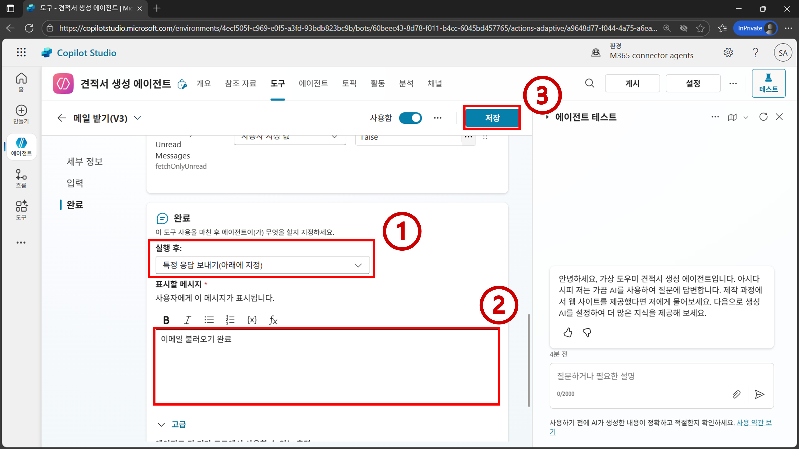
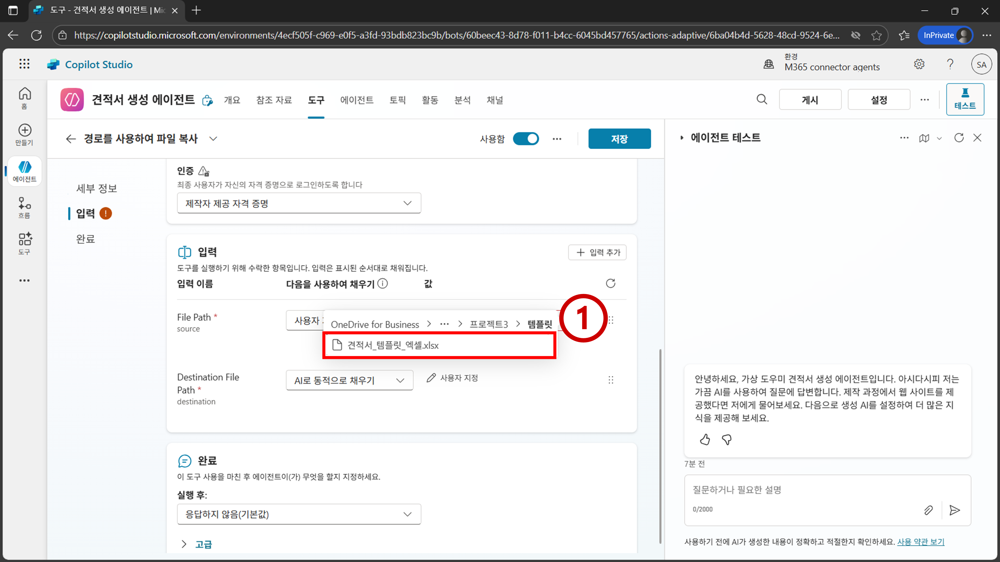

# 프로젝트3 - 견적서 생성 에이전트

<iframe width="560" height="315" src="https://www.youtube.com/embed/UCHbtPO8grM" title="프로젝트3 견적서 생성 에이전트" frameborder="0" allow="accelerometer; autoplay; clipboard-write; encrypted-media; gyroscope; picture-in-picture; web-share" referrerpolicy="strict-origin-when-cross-origin" allowfullscreen></iframe>

## 학습 목표
- 지식 (Knowledge)
- 원드라이브 (OneDrive) 커넥터 이해
- 아웃룩 (Outlook) 커넥터 이해

## 시나리오
- B2B 거래 특성 상 이미 논의가 완료된 거래 건에 대하여 기록을 남기기 위해 이메일로 물품 견적 등을 요청하는 경우가 있다.
- 견적서를 회신하기 위해 실무자는 이메일을 확인하여 견적서에 들어가야 하는 품목과 개수를 확인해야 한다. 사내 물품 단가표를 확인하여 물품별 단가를 확인하고, 기존에 사용하던 견적서 템플릿 파일을 복사하여 품목과 개수, 단가를 입력하는 작업을 진행한다. 
- 이메일, 엑셀, 등 여러 파일들을 확인하고 데이터를 옮기는 과정 중에 단가 및 물품 개수를 잘못 확인하거나, 또는 견적서에 하나씩 입력하는 과정 중에 휴먼 에러가 발생할 가능성이 존재한다. 
- 본 프로젝트에서는 이메일 및 엑셀 파일 등을 확인하여 자동으로 견적서를 생성하는 에이전트를 만들어 본다.

## 지시사항

1. Outlook으로 이동하여 본인에게 다음과 같은 이메일을 발송한다.
```
받는 사람: 본인
제목: 견적서 문의
내용:
안녕하세요.

유선으로 문의드린 대로 USB 15개, 마우스 2개, 이어폰 3개 견적 부탁드립니다.

문의 사항 있을 시 편하게 연락 부탁드립니다.

감사합니다!
```


2. `https://copilotstudio.microsoft.com/`로 이동하여 `에이전트 > 새 에이전트`를 클릭한다.


3. `구성`을 클릭한 뒤 에이전트의 메타데이터를 아래와 같이 설정한다
- `이름`: `견적서 생성 에이전트`
- `설명`: `견적서 템플릿을 채워 견적서 만드는 것을 도와주는 에이전트`
- `지침`: `.` 


4. `웹 검색`을 `사용 안 함`으로 설정한다. 그리고 우측 상단에 `만들기`를 클릭한다.


5. `도구 > 도구 추가`를 클릭한다.


6. `Office 365 Outlook`을 클릭한다.


7. `메일 받기(V3)`을 클릭한다.


8. `연결`에 앞서 실습 환경 설정 단계에서 구축해둔 본인의 이메일로된 연결이 자동 선택된 것을 확인한다. `추가 및 구성`을 클릭한다.


9. `메일 받기(V3)` 작업의 `설명`값을 `해당 작업을 사용해서 이메일을 가지고 와 주세요`로 수정한다.


```{Note}
작업(action)의 이름과 설명은 AI가 해당 작업을 선택하는데 중요한 영향을 미친다. 해당 작업의 특징과 언제 사용되어야 하는지 구체적으로 적어 줄 수록 좋다.
```

10. `추가 세부 정보 > 인증` 값을 `제작자 제공 자격 증명`으로 설정한다.


11. `입력 > 입력 추가`를 클릭한다. 검색 창에 `Top`, `Subject Filter`, `Fetch Only Unread Messages`를 검색한 뒤 각 입력 파라미터를 추가한다.


```{Note}
필수 파라미터는 기본적으로 추가되어 있는 상태다. 그 외 필수가 아닌(Optional) 파라미터들은 사용할려면 직접 추가해야 한다.
```

12. 입력 값들을 아래와 같이 설정한다. `Fetch Only Unread Messages`는 제공되는 선택지 중에 `False`가 있으므로 해당 값을 선택지에서 선택한다. 나머지는 직접 입력한다.
- `Top`: `사용자 지정 값`, `1`
- `Subject Filter`: `사용자 지정 값`, `견적서`
- `Fetch Only Unread Messages`: `사용자 지정 값`, `False`


13. `완료 > 실행 후`를 `특정 응답 보내기(아래에 지정)`으로 설정한다. `표시할 메시지`에 `이메일 불러오기 완료`를 입력한다. 그리고 `저장`을 클릭한다.


14. `도구 > 도구 추가`를 클릭한다.


15. `비지니스용 OneDrive`를 클릭한다.


16. `경로를 사용하여 파일 복사`를 클릭한다.


17. `연결`에 앞서 실습 환경 설정 단계에서 구축해둔 본인의 이메일로된 연결이 자동 선택된 것을 확인한다. `추가 및 구성`을 클릭한다.


18. `추가 세부 정보 > 인증` 값을 `제작자 제공 자격 증명`으로 설정한다.


19. `File Path`를 `사용자 지정 값`으로 설정하고 `폴더` 아이콘을 클릭한다.


20. `Root > 코파일럿 에이전트 교육 개인 폴더 > 프로젝트3 > 템플릿 > 견적서_템플릿_엑셀.xlsx` 파일을 선택한다.


21. `Destination File Path`를 `사용자 지정 값`으로 설정한 뒤 `값`에는 `/코파일럿 에이전트 교육 개인 폴더/프로젝트3/견적서/견적서.xlsx`를 입력한다.


22. `완료 > 실행 후`를 `특정 응답 보내기(아래에 지정)`으로 설정한다. `표시할 메시지`에 `견적서 복사 완료`를 입력한다. 그리고 `저장`을 클릭한다.


23. `도구 > 도구 추가`를 클릭한다.


24. `Excel Online(Business)`를 클릭한다.


25. `테이블에 행 추가`를 클릭한다.


26. `연결`에 앞서 실습 환경 설정 단계에서 구축해둔 본인의 이메일로된 연결이 자동 선택된 것을 확인한다. `추가 및 구성`을 클릭한다.


27. `추가 세부 정보 > 인증` 값을 `제작자 제공 자격 증명`으로 설정한다.


28. `Location`을 `사용자 지정 값`으로 설정한다. `값`을 `OneDrive for Business`로 설정한다.


29. `Document Library`를 `사용자 지정 값`, `OneDrive` (또는 `문서`로 이름이 되어 있을 수 있음)로 설정한다. `File`을 `사용자 지정 값`으로 설정한 뒤 `폴더` 아이콘을 클릭한다.


30. `코파일럿 에이전트 교육 개인 폴더 > 프로젝트3 > 템플릿 > 견적서_템플릿_엑셀.xlsx`을 선택한다.


31. Table을 `사용자 지정 값`으로 설정한 뒤 `값`을 `Invoice`로 선택한다.


```{Note}
Table에는 엑셀 내에 만들어 둔 테이블이 선택지로 표시된다. 견적서는 영어로 Quotation이라고 한다. 본 예제에서는 영문명이 잘못 들어갔다.
```

32. `File`을 `AI로 동적으로 채우기`로 설정한다. 그리고 `사용자 지정`을 클릭한다.


33. `File`의 `설명`란에 [project3-snippets.txt](https://github.com/Indie-Garage/copilot-studio/blob/main/snippets/project3-snippets.txt) 파일 내 33번 값을 입력한다. 그리고 `X`를 클릭한다.


```{Note}
템플릿 파일은 그대로 보존하고, OneDrive 커넥터를 사용해 복사한 파일에 견적 품목을 채워 넣을려고 한다. 그렇기 때문에 복사한 파일의 고유 경로(driveItemID)를 `File`에 입력해줘야 한다. 고유 경로는 OneDrive 커넥터의 결과물에 다른 메타데이터와 함께 존재한다. 그렇기 때문에 고유 경로의 포맷을 알려줌으로써 해당 경로가 추출되어 `File`에 맵핑될 수 있도록 한다.
```

34. `Row`의 `사용자 지정`을 클릭한다.


35. `설명`란에 [project3-snippets.txt](https://github.com/Indie-Garage/copilot-studio/blob/main/snippets/project3-snippets.txt) 파일 내 35번 값을 입력한다. 그리고 `X`를 클릭한다.


36. `완료 > 실행 후`를 `특정 응답 보내기(아래에 지정)`으로 설정한다. `표시할 메시지`에 `견적서 품목 한 항목 추가 완료`를 입력한 뒤 `저장`을 클릭한다.


37. `참조 자료 > 참조 자료 추가`를 클릭한다.


38. `SharePoint`를 클릭한다.


39. `항목 찾아보기`를 클릭한다.


40. `코파일럿 에이전트 교육` 쉐어포인트로 이동한 뒤 `일반 > 프로젝트3 > 품목 현황` 폴더를 선택하고 `선택 확인`을 클릭한다.


```{Note}
폴더를 선택하면 해당 폴더 내에 있는 모든 파일을 참조 자료로 사용한다. 특정 파일을 선택하면 해당 파일만 참조 자료로 사용한다.
```

41. `에이전트에 추가`를 클릭한다.


```{Note}
참조 자료의 이름과 설명을 언제 사용되어야 하는 자료인지 구체적으로 적으면 필요한 상황에서 더 잘 선택될 수 있다.
```

42. `개요` 페이지에서 `지침`을 [project3-snippets.txt](https://github.com/Indie-Garage/copilot-studio/blob/main/snippets/project3-snippets.txt) 파일 내 42번 값으로 수정한다. 


```{Note}
<> 사이에 있는 값들은 `/`(슬래쉬)를 사용하여 해당 도구를 찾아서 입력한다.
```

43. 테스트 입력란에 `견적서 작성`을 입력한다.


44. `활동 지도`를 확인하면 메일을 확인한 뒤 메일에 있는 품목들의 단가를 참조 자료에서 확인하고, 템플릿 파일을 복사한 뒤 복사된 파일에 견적서 품목을 단가와 함께 하나씩 추가하는 것을 확인할 수 있다.


45. OneDrive에 `내 파일 > 코파일럿 에이전트 교육 개인 폴더 > 프로젝트 > 견적서`로 이동하면 `견적서.xlsx` 파일이 새롭게 생성된 것을 확인할 수 있다.


46. 이메일에서 요청한 품목 및 품목별 개수가 적절하게 입력된 것을 확인할 수 있고, 각 품목별 단가 또한 `코파일럿 에이전트 교육` 쉐어포인트 사이트에 있는 `품목 현황.xlsx` 파일 내에 있는 단가들로 적절하게 채워진 것을 확인할 수 있다. 그 외 합계, 공급가액, VAT 등의 값들은 엑셀 수식으로 채워진 것이다.


## LLM이 두각을 보여주는 핵심 위치
- 이메일에서 적절한 품목명과 품목명별 개수를 추출해오는 작업을 할 때 LLM이 두각을 보인다.
- 기존의 규칙 기반(rule-based) 방법으로 해당 작업을 구현하는 것은 상당히 많은 사전 작업이 필요할 수 있기 때문이다.

## 참고 문헌
- https://learn.microsoft.com/en-us/connectors/onedrive/#copy-file-using-path

- https://learn.microsoft.com/en-us/connectors/office365/#get-emails-(v3)