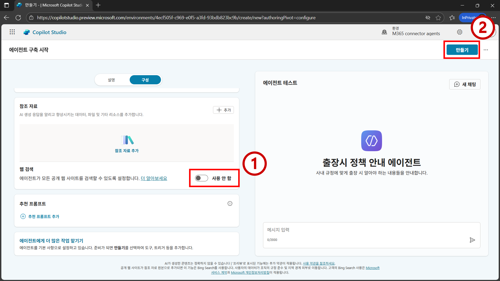
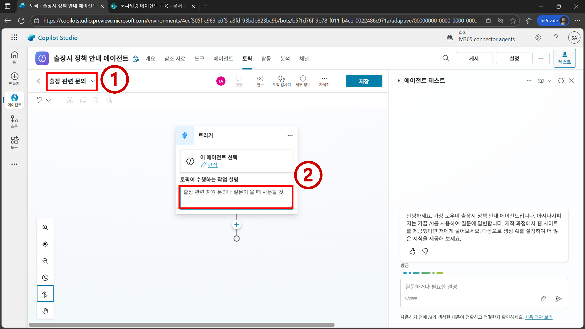
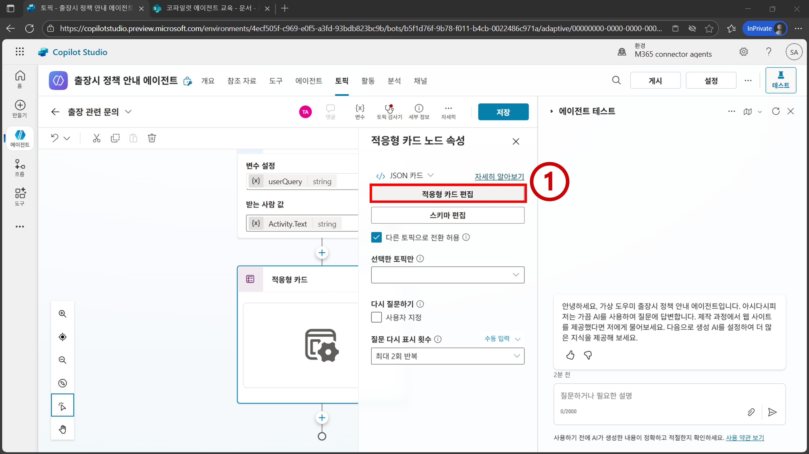

# 프로젝트4 - 사내 및 사외 문서 기반 답변 에이전트

<iframe width="560" height="315" src="https://www.youtube.com/embed/iUTrr4kwQEc" title="프로젝트4 사내 및 사외 문서 기반 답변 에이전트" frameborder="0" allow="accelerometer; autoplay; clipboard-write; encrypted-media; gyroscope; picture-in-picture; web-share" referrerpolicy="strict-origin-when-cross-origin" allowfullscreen></iframe>

- 퍼블릭 웹사이트 지식(Knowledge)의 특징 및 한계점 이해
- 토픽(Topic), 적응형 카드(Adaptive Card) 이해
- 토픽, 적응형 카드, 및 Power Fx를 활용한 결정론적인 방법으로 에이전트가 참조할 수 있는 지식의 범위를 제어하는 테크닉 이해

## 시나리오
- 이번 프로젝트에서는 2개의 에이전트를 만들어 본다. 
- 웹 상에 공개된 특정 사이트 내에 있는 내용을 기반으로 답변하는 에이전트를 구축할 때의 주의점을 살펴본다. (지시사항 1~9)
- 또한, 에이전트 사용자의 입력값을 받아서 사용자에게 적절한 지식이 사용될 수 있게 결정론적으로 조절하는 지식 범위 제어 테크닉을 살펴본다. (지시사항 10~33)

## 지시사항

1. `https://copilotstudio.microsoft.com/`로 이동하여 `에이전트 > 새 에이전트`를 클릭한다.


2. `구성`을 클릭한 뒤 에이전트의 메타데이터를 아래와 같이 설정한다.
- `이름`: `Microsoft Learn 챗봇`
- `설명`: `Microsoft Learn 관련 질문에 대해 답변합니다.`
- `지침`: `사용 가능한 지식을 적극적으로 활용하여 사용자의 질문에 답변합니다.`


3. `웹 검색`을 `사용 안 함`으로 설정한다. 그리고 우측 상단에 `만들기`를 클릭한다.


```{Note}
웹 검색은 Bing 검색 엔진을 통해 인덱싱된 모든 페이지를 기반으로 답변한다. 이번 실습에서는 특정 사이트 내의 페이지 기반으로만 답변하는 에이전트를 만들어 보기 위해 웹 검색을 비활성화 한다.
```

4. `참조 자료 추가`를 클릭한다.


5. `공개 웹 사이트`를 클릭한다.


6. `링크 입력`란에 `https://learn.microsoft.com/ko-kr/training/`를 입력 한 뒤 `추가`를 클릭한다. 그리고 `에이전트에 추가`를 클릭한다.


```{Note}
웹 사이트 루트로 부터 두 단계의 하위 레벨 까지만 사이트 경로를 입력받는다. 실제 참조 시키고자 하는 페이지는 https://learn.microsoft.com/ko-kr/training/support/troubleshooting 이지만, 기능적인 한계로 인해 https://learn.microsoft.com/ko-kr/training 까지만 추가한다.
```

7. 테스트 메시지 입력란에 `Cloud Shell을 시작할 수 없습니다 라는 에러 메시지가 뜹니다`를 입력 및 전송한다.


8. `활동 지도`에 `참조 자료` 작업이 실행된 것을 확인할 수 있다. `참조되는 원본`의 각 참조 자료들의 `... > 열기` 버튼을 클릭하여 해당 사이트로 이동할 수 있다. 페이지의 범위가 넓다 보니 `https://learn.microsoft.com/ko-kr/training/support/troubleshooting` 페이지가 참조되지 않을 수 있다.


9. 의도하고자 한 목적은 `https://learn.microsoft.com/ko-kr/training/support/troubleshooting` 페이지 내에 있는 트러블슈팅 가이드에 대한 답변인데, `공개 웹 사이트` 기능의 한계로 인해 해당 페이지를 직접적으로 추가 시키진 못한다. 그에 따라 해당 페이지가 답변 될 수도 있고, 다른 페이지 기반으로 답변이 될 수도 있다. 해당 페이지 기반으로만 참조 되게 할려면 다른 방법을 찾아봐야 한다.


10. `https://copilotstudio.microsoft.com/`로 이동하여 `에이전트 > 새 에이전트`를 클릭한다.


11. `구성`을 클릭한 뒤 에이전트의 메타데이터를 아래와 같이 설정한다.
- `이름`: `출장시 정책 안내 에이전트`
- `설명`: `사내 규정에 맞게 출장 시 알아야 하는 내용들을 안내합니다.`
- `지침`: `제공된 정보를 기반으로 정확하게 사용자의 질문에 답을 해야 합니다.`


12. `웹 검색`을 `사용 안 함`으로 설정한 뒤 `만들기`를 클릭한다.


13. `토픽 > 토픽 추가 > 새로 시작`을 클릭한다.


14. 토픽명을 `출장 관련 문의`로 설정한다. `토픽이 수행하는 작업 설명`을 `출장 관련 지원 문의나 질문이 올 때 사용할 것`으로 설정한다.


15. `노드 추가` 버튼을 클릭한 뒤 `변수 관리 > 변수 값 설정`을 클릭한다.


16. `변수 설정 > 변수 선택`을 클릭한 뒤 `새로 만들기`를 클릭한다.


17. `변수 이름`을 `userQuery`로 설정한 뒤 `X`를 클릭한다.


18. `받는 사람 값 > ... > 시스템`을 클릭한 뒤 검색창에 `text`를 입력한다. `Activity.Text`를 클릭한다.


```{Note}
Activity.Text에는 사용자가 보낸 가장 최근 메시지가 저장되어 있다.
```

19. `노드 추가 > 적응형 카드로 질문`을 클릭한다.


20. 적응형 카드의 `... > 속성`을 클릭한다.


21. `적응형 카드 편집`을 클릭한다.


22. `카드 페이로드 편집기`에 [project4-snippets.txt](https://github.com/Indie-Garage/copilot-studio/blob/main/snippets/project4-snippets.txt) 파일 내 22번 값을 입력한다. `Save`를 클릭한 뒤 `Close`를 클릭한다.


```{Note}
적응형 카드를 사용하면 적절한 인터페이스를 구축하여 에이전트의 사용자로 부터 특정한 입력 값을 받을 수 있다. 또는 에이전트의 답변을 출력할 때 적절한 인터페이스를 만들어 사용할 수도 있다. 자세한 내용은 https://adaptivecards.microsoft.com/ 에서 확인 가능하다.
```

23. `노드 추가 > 고급 > 생성형 답변`을 클릭한다.


24. `입력 > ...`로 이동하여 `userQuery`를 선택한다. 그리고 데이터 원본의 `편집`을 클릭한다.


25. `참조 자료 원본` 메뉴 내에 `선택한 원본만 검색`을 활성화 한다. `AI에서 자체 일반 지식(프리뷰)을 사용할 수 있습니다.`를 비활성화 한다. 그리고 `클래식 데이터`를 클릭한다.


26. SharePoint의 설정을 `수식`으로 변경한다.


27. SharePoint의 `... > 수식`을 클릭한 뒤 수식 입력란에 [project4-snippets.txt](https://github.com/Indie-Garage/copilot-studio/blob/main/snippets/project4-snippets.txt) 파일 내 27번 값을 적절하게 수정한 뒤 입력한다. 그리고 `삽입`을 클릭한다.


28. `노드 추가 > 토픽 관리 > 현재 토픽 종료`를 클릭한다.


29. `저장`을 클릭한다. `설정`을 클릭한다.


30. `지식 > 일반 참조 자료 사용`을 비활성화 한 뒤 `저장`을 클릭한다. 그리고 `X`를 클릭한다.


31. `개요` 페이지로 이동한 뒤 `지침`을 [project4-snippets.txt](https://github.com/Indie-Garage/copilot-studio/blob/main/snippets/project4-snippets.txt) 파일 내 31번 값으로 수정한다. 테스트 입력란에 `출장비 얼마까지 지원되나요`를 입력 및 전송한다.


```{Note}
<> 사이에 있는 값들은 `/`(슬래쉬)를 사용하여 해당 토픽을 찾아서 입력한다.
```

32. 적응형 카드의 선택지 중에서 `경기`를 선택한 뒤 `제출`을 클릭한다.


33. 최종적으로 `코파일럿 에이전트 교육` 쉐어포인트 내에 있는 `문서 > 일반 > 프로젝트4 > 경기 > 경기 지사 임직원 출장 규정.docx` 파일을 기반으로 경기 지역 기준 사내 규정에 맞게 적절한 답변을 반환하는 것을 확인할 수 있다.


```{Note}
토픽을 사용하여 결정론적(deterministic)으로 지식이 선택될 수 있게 구현되었다.
```

## 참고 문헌
- https://github.com/microsoft/mcs-labs/tree/main/labs/ask-me-anything#-use-case-4-knowledge-prioritization-techniques 

- https://github.com/microsoft/mcs-labs/tree/main/labs/ask-me-anything#-use-case-7-ai-summary-and-review-of-meeting-notes 
